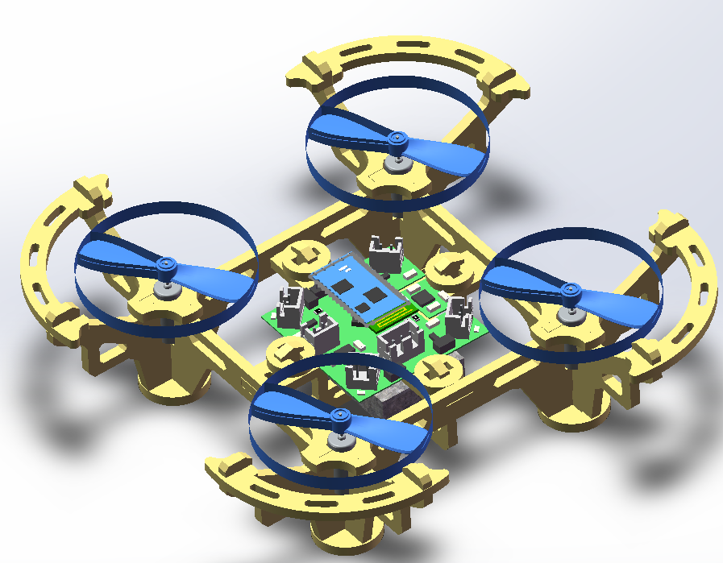
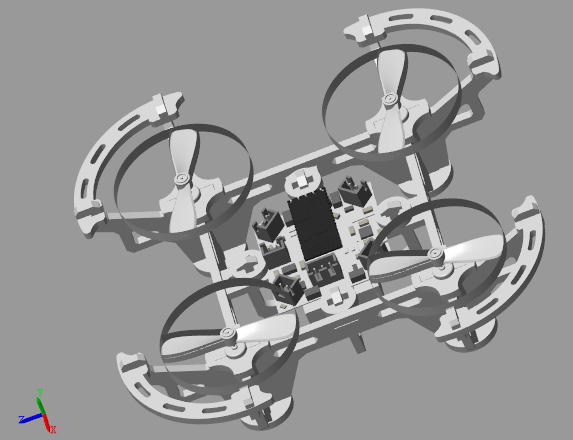
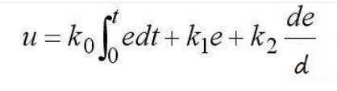
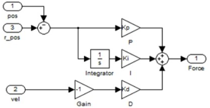
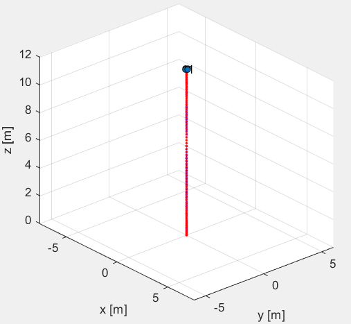
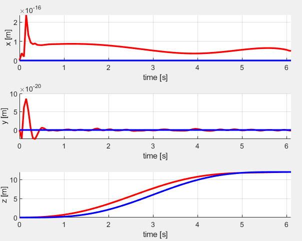
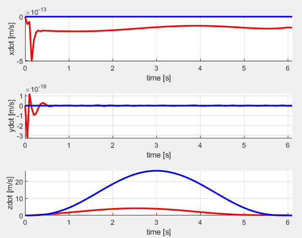

# Drone_Simulation

在无人机仿真方面，我们分别对无人机结构和无人机巡航做了仿真。

## 无人机结构仿真

我们使用了SOLIDWORKS软件进行绘制，详细地描述了无人机各零件并结合成整机。

在此基础上，我们通过使用SimMechanics Link自动化生成了SimMechanics模型，并将模型导入matlab中。通过增加输入，我们可以观察无人机的飞行情况。

## 无人机巡航仿真

我们将重点放在了无人机外环控制上。这一部分我们采用了传统的PID控制模块对无人机飞行进行控制。PID的原型可以表示为：

它是一个根据反馈误差来修正输出函数的过程。K0，K1，K2这三个参数可以为0，那么就形成了PI、PD、ID、PID这几种形式。一般PID、PD这两种用的比较多。而我们使用的为PD。

在确定好航线之后，我们可以得到无人机巡航仿真路线图，位移图与速度图如下：

（巡航路线图）

（位移图）

（速度图）

图中蓝线为理想状况下无人机飞行路线情况以及参数情况，红线为在考虑重力与呈正态分布的干扰噪声环境下无人机的路线情况以及参数情况。

在此基础上，为了方便初学者对于无人机飞行情况真实把握以及感受PID参数调节对无人机的影响，我们建立了用户交互界面。用户可以自主调节PID参数并自主控制无人机飞行，通过这种方式来模拟无人机飞行的真实情况，并了解PID参数是如何影响无人机飞行状态的。
